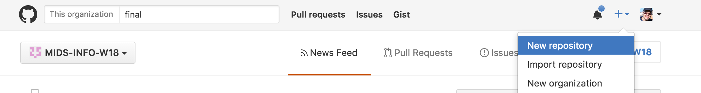
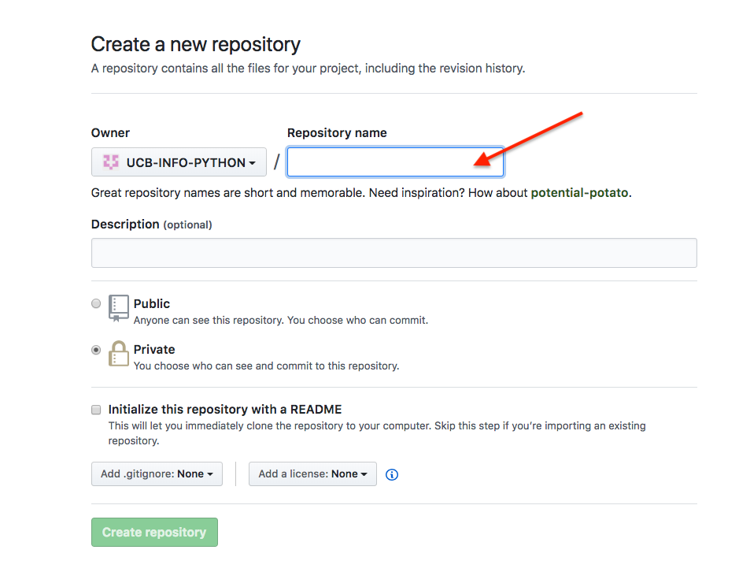
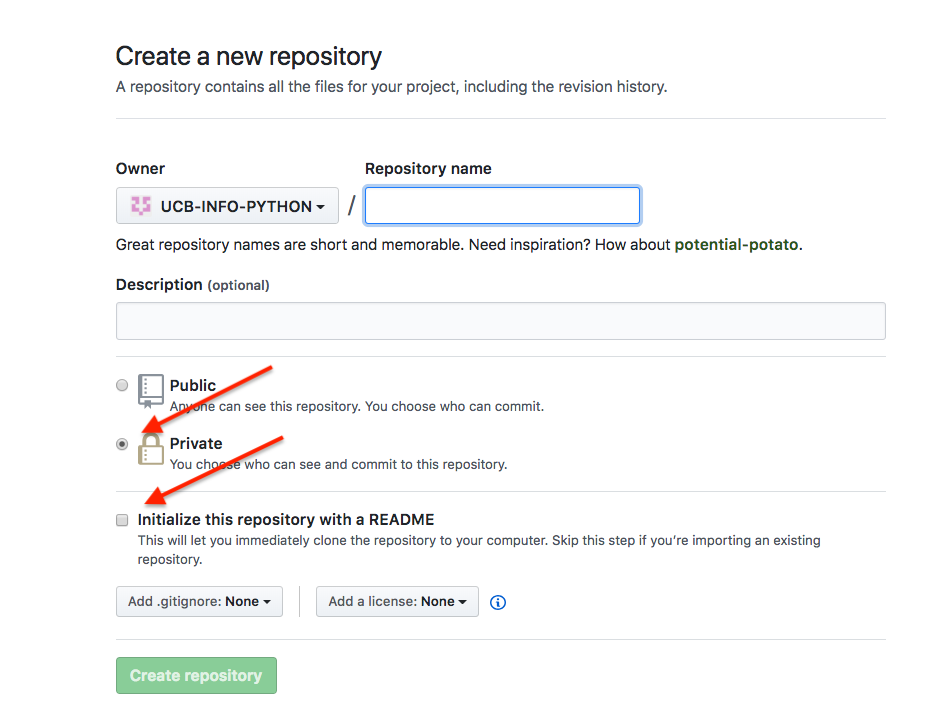
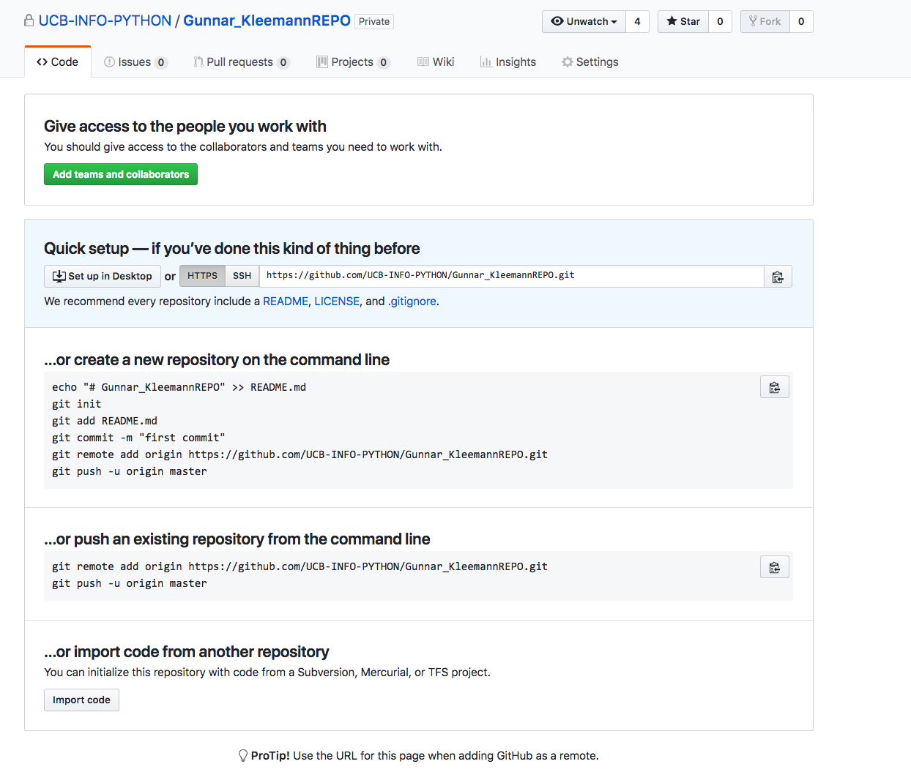
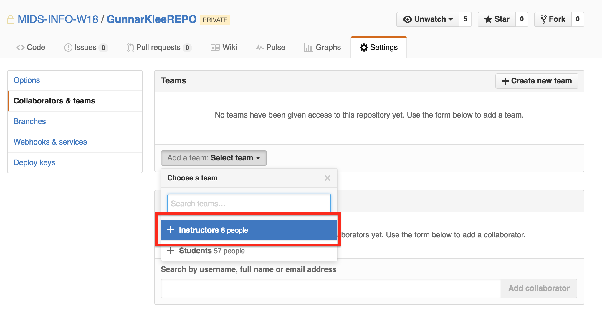
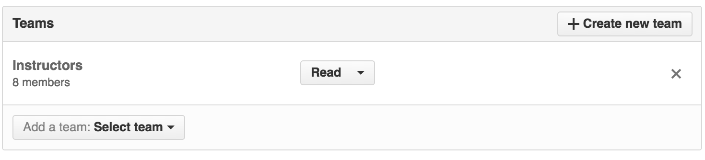
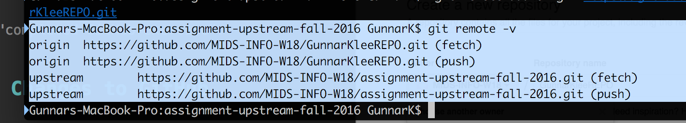
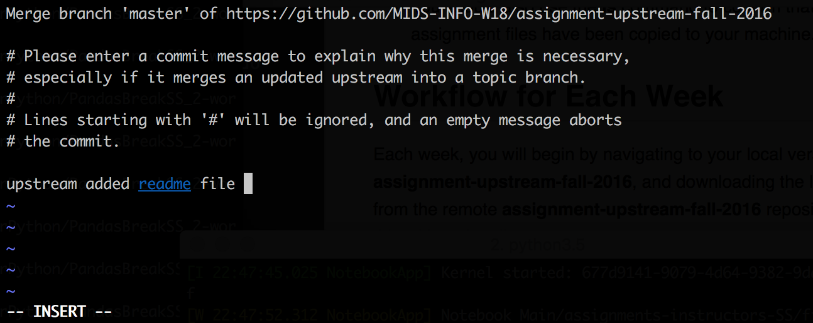
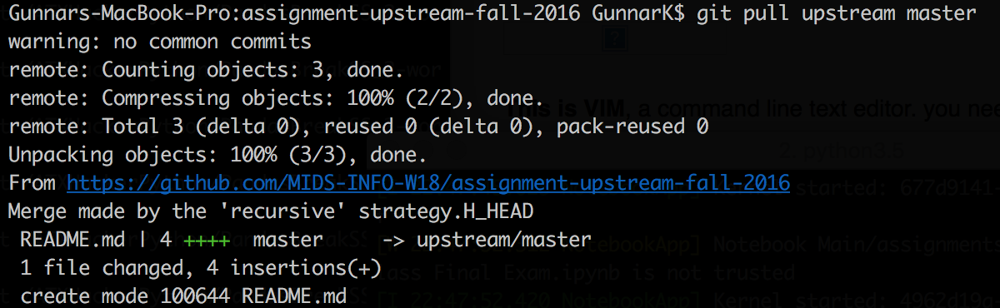

## First excercise with Git 

Before proceeding, use the following instructions to set up your local assignment repository.  This will be the place you work on your class assignments and it will be linked to two remote repositories on GitHub making a V shaped unidirectional workflow:

**Download [1.15 The Course Workflow.pptx](https://github.com/MIDS-INFO-W18/Course-Syllabus/blob/master/week_01/1.15%20The%20Course%20Workflow.pptx) for a diagram of this process** 

1. **assignment-upstream-fall17** - You should be able to find this repository in our class organization on GitHub: **https://github.com/MIDS-INFO-W18/assignments_upstream_fall17** (or https://github.com/MIDS-INFO-W18/assignment-upstream-w18 for the 10 week course). This is where we will post all class assignments.  You have read access to this repository, and each week you will use a pull command to download the latest assignments to your own machine then push your submissions to your student repository **(recall the "V" shape)**.
2. **Your student repository** - In this excercise you will make your own student remote repository. You should have write access to your student repisitory, but it will be only readable by you and your instructors.  When you complete your homework each week, you will use a push command to upload your work to this repository.

## Initial Setup

There are several ways that you can set up your local repository.  We recommend the following procedure.  

First create an empty repository in Github for your homework, you can do this through the github user interface.


## Create a new repository 

* this is done through the add menu on the upper right




--
* Put your repository in the MIDS-INFO-W18 organization
* Name it your FirstnameLastnameREPO so mine should be **"GunnarKleemannREPO"**




--
* Make the repository **private** with the radio button
 
# Important: Do not add a readme file you need an empty repository




# Give the instructors read access

* In your new **private** repository, go to the settings tab, on the right and then select collaborators and teams on the left



* Give (only) instructors read access:



* You should see this:



## Clone the assignments directory on your system


You need to tell git that you will be pulling content (homeworks) onto your machine from assignment-upstream-fall17 and pushing modified content (completed homeworks) to YourNameREPO on github

Open a command prompt and use it to navigate to your desktop or course working directory.  Then execute the following commands:

*Note: lines preceeded by "#" are comments to explain each step and should not be executed.* 

``` sh
# clone the assignment repository onto your computer

git clone https://github.com/MIDS-INFO-W18//assignments_upstream_fall17.git
# (or https://github.com/MIDS-INFO-W18/assignment-upstream-w18.git for the 10 week course)

# Note: This may be an empty repository at the beginning of the course.

cd assignments_upstream_fall17
# (or cd assignment-upstream-w18 for the 10 week course)

git remote add upstream https://github.com/MIDS-INFO-W18/assignments_upstream_fall17.git
# or git remote add upstream https://github.com/MIDS-INFO-W18/assignment-upstream-w18.git
```

You can find the URL for YourNameREPO by navigating to the appropriate repository in your web browser, then clicking on the "Clone or download" button in the upper right corner.

``` sh
# set the origin to your personal repository

git remote remove origin
git remote add origin <ENTER YOUR REPOSITORY HTTPS URL HERE>

# i.e. git remote add origin https://github.com/MIDS-INFO-W18/GunnarKleeRepo.git


```

To check if you did everything right, execute the following command:

``` sh
git remote -v
```

* The output should show "fetch" and "push" for two remotes, one named origin and one named upstream. 


###### Note: the name of the upstream folder differs based on the semester. The example screenshots are from fall 2016 thus we see: assignment-upstream-fall-2016.  




* You should also use the **ls** command to confirm that the assignment files have been copied to your machine.
	

## Workflow for Each Week

Each week, you will begin by navigating to your local version of **assignments_upstream_fall17**, and downloading the latest changes from the remote assignments-upstream-fall17 repository. You do this with a git pull:

``` sh
git pull upstream master
```

Next, you will have a **assignments_upstream_fall17/SUBMISSIONS** folder that you will make in the next exercise.

* Make a copy of your assigmment and move it to the SUBMISSIONS folder. 
 
* Complete all the exercises in the **assignments_upstream_fall17/SUBMISSIONS** folder on your local machine and commit your changes to git.  

* Finally, you'll push your changes up to your personal student repository on github.  You can do this with the following command:

```sh
git push origin master
```


## Completing the Exercise

For this exercise you will post your first work to the assignments-upstream-fall17 repository. The Github repository **installation** contains the exercise. 

* Make a new folder called **"SUBMISSIONS"** in your local assignment-upstream-fall17 folder

	* Try using the **mkdir** command from within your local assignment-upstream-fall17

* Clone the installation directory to your local machine

```sh
git clone https://github.com/MIDS-INFO-W18/Installation.git
```

* Copy the file "First\_GitHub\_Exercise.txt" 
	* From your local **Installation** directory. 
To your local **assignments_upstream_fall17/SUBMISSIONS** folder (or **assignment-upstream-w18/SUBMISSIONS** folder)
	* To copy the file you can practice using the command line **cp** command or just drag and drop the file.

* Open the file, answer the questions, and save.

* Commit the changes to your local repository. Go back to your command terminal and type the following.

```sh
git status
```
* This should confirm that you have a modified file in your repository. Go ahead and add the file.

``` sh
git add SUBMISSIONS/

#check status to see that your file has been added as a new file (in green) 

git status

#Then commit your changes.

git commit -m "completed GitHub exercise".

```
## Pushing Changes to GitHub

Now it is time to push your changes up to your GitHub repository. First, run `git status` to confirm that all your code is currently committed.  Next, push your changes to the master branch of origin, representing your repository on GitHub.

```sh
git push origin master
```

Check the GitHub repository in your browser to confirm that your changes are there.


## merging 

* Note: from time to time you may have to merge the upstream and your local drive when you **pull** in a version of the repository that are not the same. you may see a screen like this



**This is VIM**, a command line text editor. you need to enter a short message overwriting one of the blue tilde and then write the message to file

to do this:

1) Type 'i' to enter the "insert" mode (look to the bottom of the screen for the word "INSERT"

2) Use arrow keys to navigate to the line above the blue tilde and type in a message (any explanation about one line long)

3) Exit the insert mode by pushing "esc" ("INSERT" will disapear) then 

4) type **:wq** this means *"write then quit"*
you should see some sort of message indicating that the merge was sucessful as shown below.


